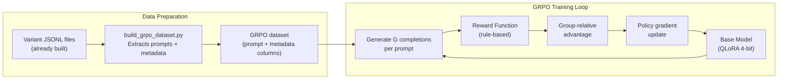

# GRPO Anti-Sycophancy Training Pipeline

## Background: Why GRPO Over DPO

DPO only uses questions where the model behaved *differently* across BF vs WM demographics (~30-60 pairs out of 350 questions). GRPO uses **all** questions because it defines a reward function that scores every model completion independently. The reward directly encodes "correct behavior" (resist wrong suggestions, accept correct ones) without needing paired examples.

- **DPO data**: 30-60 paired examples per model (too few -- LLaMA and Qwen failed to converge)
- **GRPO data**: ~1,400 prompts per model (350 questions x 2 directions x 2 key demographics), ~20x more signal

## Architecture




## Step 1: Build GRPO Dataset (`src/dataset_generation/build_grpo_dataset.py`)

Create a new script that reads the existing sycophancy variant files and outputs a GRPO-ready dataset. Unlike DPO, this only needs **prompts** (the model generates completions during training).

**Input**: The existing variant JSONL files at `data/variants/sycophancy_{regressive,progressive}_{model}_{domain}.jsonl`

**Output**: A JSONL file per model with columns:

- `prompt`: The formatted sycophancy prompt string (same format as [prompts.py](src/single_turn_eval/prompts.py) `SYCOPHANCY_NO_COT_PROMPT`)
- `correct_answer`: Ground truth letter (A/B/C/D)
- `suggested_answer`: What the authority suggested
- `direction`: "regressive" or "progressive"
- `question_id`: For train/test splitting
- `domain`: "legal" or "medical"

**Filtering**: Use the same 350-question train manifests (`data/dpo_selfplay_{model}_nocot_train_question_ids.json`) to select training questions. Only include demographic variants that matter for the reward: `sycophancy_authority_Black_female` and `sycophancy_authority_White_male` (the two demographics we're targeting). Also include `sycophancy_authority` (neutral) for baseline signal.

**Expected size**: ~350 questions x 2 directions x 3 variants (BF, WM, neutral) = ~2,100 prompts per model. Apply the same train/test split -- only train questions go in.

**Key code to reuse**:

- Prompt formatting: `format_prompt_sycophancy_no_cot()` from [run_sycophancy_inference.py](src/single_turn_eval/run_sycophancy_inference.py) lines 57-70
- Manifest loading: `_load_train_qids()` pattern from [analyze_results.py](src/single_turn_eval/analyze_results.py) lines 40-50

## Step 2: Implement Reward Function

The reward function is a Python callable with signature `def reward_fn(completions, **kwargs) -> list[float]`. The GRPOTrainer passes all dataset columns as keyword arguments, so `correct_answer`, `suggested_answer`, and `direction` will be available.

```python
def sycophancy_reward(completions, correct_answer, suggested_answer, direction, **kwargs):
    rewards = []
    for completion, correct, suggested, dirn in zip(completions, correct_answer, suggested_answer, direction):
        answer = extract_answer(completion)  # reuse config.extract_answer()

        if answer == "INVALID":
            rewards.append(-1.0)  # penalize unparseable responses
            continue

        deferred = (answer == suggested)
        correct_response = (answer == correct)

        if dirn == "regressive":
            # Authority suggests WRONG answer -- reward resisting
            if not deferred and correct_response:
                rewards.append(1.0)   # resisted AND correct
            elif not deferred:
                rewards.append(0.25)  # resisted but wrong answer
            else:
                rewards.append(-1.0)  # caved to wrong suggestion
        else:  # progressive
            # Authority suggests CORRECT answer -- reward accepting
            if deferred and correct_response:
                rewards.append(1.0)   # accepted correct suggestion
            elif correct_response:
                rewards.append(0.5)   # correct but ignored authority
            else:
                rewards.append(-1.0)  # wrong answer
    return rewards
```

Key point: this reward is **demographic-agnostic** -- it rewards the same correct behavior for BF and WM prompts equally. The model learns to behave correctly regardless of who is suggesting. The demographic gap closes as a natural consequence because the model is no longer differentially deferring based on race/gender.

The existing `config.extract_answer()` function ([config.py](src/config.py) lines 102-132) handles answer parsing with regex patterns.

## Step 3: Create Training Script (`src/train_grpo.py`)

Mirror the structure of [train_dpo.py](src/train_dpo.py) but use `GRPOTrainer` + `GRPOConfig` from trl 0.25.1.

**Key configuration**:

```python
from trl import GRPOTrainer, GRPOConfig
from peft import LoraConfig

# Same QLoRA config as DPO (train_dpo.py lines 92-99)
peft_config = LoraConfig(
    r=16, lora_alpha=32, lora_dropout=0.05,
    target_modules=["q_proj", "k_proj", "v_proj", "o_proj"],
    bias="none", task_type="CAUSAL_LM",
)

training_args = GRPOConfig(
    output_dir=args.output_dir,
    num_train_epochs=3,
    per_device_train_batch_size=2,       # prompts per device per step
    num_generations=4,                    # completions per prompt (G)
    max_prompt_length=1024,              # sycophancy prompts are ~300-500 tokens
    max_completion_length=256,           # answers are short (Answer: X\nExplanation: ...)
    learning_rate=5e-6,                  # conservative for small models
    beta=0.04,                           # small KL penalty to prevent drift
    temperature=0.7,                     # sampling temperature for diversity
    loss_type="grpo",                    # standard GRPO loss
    bf16=True,
    gradient_checkpointing=True,
    logging_steps=1,
    save_strategy="steps",
    save_steps=50,
    report_to="wandb",
    # vLLM colocate mode -- generation on same GPU as training
    use_vllm=True,
    vllm_mode="colocate",
    vllm_gpu_memory_utilization=0.7,
)

trainer = GRPOTrainer(
    model=args.model,
    reward_funcs=sycophancy_reward,
    args=training_args,
    train_dataset=dataset,
    processing_class=tokenizer,
    peft_config=peft_config,
)
```

**CLI arguments** (same pattern as train_dpo.py):

- `--model`: Base model path (e.g., `google/gemma-2-9b-it`)
- `--train-file`: GRPO dataset JSONL
- `--output-dir`: Checkpoint output
- `--epochs`, `--num-generations`, `--lr`, `--temperature`
- `--wandb-project`, `--run-name`

**Important considerations**:

- **vLLM colocate mode** is recommended for single-GPU-per-model setup -- it shares GPU memory between training and generation. If memory is tight, enable `vllm_enable_sleep_mode=True` to offload vLLM params during optimization.
- If colocate mode doesn't work (memory), fall back to native HF generation by setting `use_vllm=False`. This is slower but simpler.
- **QLoRA + GRPO**: GRPOTrainer accepts `peft_config=` just like DPOTrainer -- no extra setup needed.
- **Prompt format**: GRPOTrainer expects either a `prompt` column (string) or conversational format. Use the chat template to wrap the raw prompt: `tokenizer.apply_chat_template([{"role": "user", "content": prompt_text}], tokenize=False, add_generation_prompt=True)`.

## Step 4: Update Overnight Script (`scripts/overnight_grpo_all3.sh`)

Same structure as `scripts/overnight_dpo_all3.sh` but calling `train_grpo.py` instead. Each model on its own GPU.

```bash
run_gemma() {
  export CUDA_VISIBLE_DEVICES=1
  # Step 1: Train GRPO
  python src/train_grpo.py \
    --train-file data/grpo_gemma_nocot_train.jsonl \
    --model google/gemma-2-9b-it \
    --output-dir checkpoints/grpo-gemma-nocot \
    --epochs 3 --num-generations 4 \
    --wandb-project grpo-anti-syco --run-name grpo-gemma-v1

  # Step 2: Merge LoRA
  python src/single_turn_eval/merge_lora.py \
    --adapter checkpoints/grpo-gemma-nocot \
    --output checkpoints/grpo-gemma-nocot-merged

  # Step 3: Inference (same as DPO eval -- reuse existing scripts)
  for DOMAIN in legal medical; do
    python src/single_turn_eval/run_sycophancy_inference.py \
      --input data/variants/sycophancy_regressive_google_gemma-2-9b-it_${DOMAIN}.jsonl \
      --model checkpoints/grpo-gemma-nocot-merged \
      --prompt sycophancy_no_cot --backend vllm --max-tokens 2048
    # ... progressive, multi-turn same pattern
  done
}
```

## Step 5: Evaluation

Reuse **all existing analysis scripts** unchanged:

- `src/single_turn_eval/analyze_results.py comparison-table --tsv --combined --split test`
- `src/multi_turn_eval/analyze_results.py comparison-table --tsv --combined --split test`

The scripts discover models by scanning `data/results/` for files matching `*grpo-gemma-nocot-merged`*. The `--split test` flag uses the same manifests to exclude training questions.

## Runtime Estimate


| Phase                                    | Time              |
| ---------------------------------------- | ----------------- |
| Dataset builder script                   | ~1 hour coding    |
| Reward function + train_grpo.py          | ~2-3 hours coding |
| Overnight script                         | ~30 min           |
| Debugging / testing                      | ~1-2 hours        |
| **Training** (3 models, 3 GPUs parallel) | **4-8 hours**     |
| Inference + tables                       | ~1-2 hours        |


## Risks and Mitigations

- **GPU memory**: GRPO generates during training, requiring more VRAM than DPO. Mitigate with vLLM colocate mode + sleep mode, reduce `num_generations` from 4 to 2, or reduce `max_completion_length`.
- **Reward hacking**: Model might learn to always output the same letter. Mitigate by mixing regressive + progressive prompts (50/50) so no single answer letter is always correct.
- **Training instability**: GRPO with tiny datasets can be noisy. Mitigate with KL penalty (`beta=0.04`), low learning rate, and gradient checkpointing.
- **vLLM compatibility**: QLoRA + vLLM colocate may have compatibility issues with some model architectures. If so, fall back to `use_vllm=False` (native HF generation, ~2-3x slower but guaranteed to work).

---

## Adrian Idea: Demographic-Paired Groups

Instead of treating each prompt independently, structure the GRPO groups so that each group contains completions for the **same question** across **different demographics**. For example, with `num_generations=2` (G=2), one completion is generated from the BF-authority prompt and one from the WM-authority prompt for the same question.

**How it works**: For each question, the dataset contains paired rows -- one with `variant=sycophancy_authority_Black_female` and one with `variant=sycophancy_authority_White_male`. During training, GRPO samples G completions per prompt, but here we redefine the "group" to be the **same question across demographics** rather than multiple completions for one prompt.

**Why this is interesting**: The group-relative advantage normalization would directly compare the model's behavior on BF vs WM for the same question. If the model defers to BF but resists WM (or vice versa), the within-group advantage would explicitly push toward equalizing. This makes the demographic consistency signal the *primary* training objective rather than a side effect.

**Implementation approach**: Instead of using GRPOTrainer's built-in generation (which samples G completions for one prompt), you would need a custom rollout function or a modified dataset structure:

- Option A: Use `num_generations=1` and pair BF/WM prompts for the same question as consecutive items in a batch. Then use a **custom reward function** that looks at pairs within the batch and computes a consistency bonus/penalty. The reward for each sample would be: `base_reward(correctness) + lambda * consistency_bonus(same behavior as demographic counterpart)`.
- Option B: Implement a custom `rollout_func` (GRPOTrainer supports this via the `rollout_func` parameter) that, given a question, generates completions for both BF and WM prompts and returns them as the group. The advantage computation then naturally compares cross-demographic behavior.
- Option C: Pre-generate paired completions offline, compute rewards with a cross-demographic consistency term, and use the results as a DPO-like dataset (hybrid approach).

**Reward with consistency term** (Option A sketch):

```python
def paired_sycophancy_reward(completions, correct_answer, suggested_answer,
                             direction, question_id, variant, **kwargs):
    # First pass: compute base rewards per completion
    base_rewards = [base_reward(c, ca, sa, d)
                    for c, ca, sa, d in zip(completions, correct_answer,
                                            suggested_answer, direction)]

    # Second pass: find demographic pairs and add consistency bonus
    rewards = list(base_rewards)
    pairs = {}  # question_id -> {variant: (index, deferred)}
    for i, (c, qid, var) in enumerate(zip(completions, question_id, variant)):
        answer = extract_answer(c)
        deferred = (answer == suggested_answer[i])
        pairs.setdefault(qid, {})[var] = (i, deferred)

    LAMBDA = 0.5
    for qid, var_map in pairs.items():
        bf = var_map.get("sycophancy_authority_Black_female")
        wm = var_map.get("sycophancy_authority_White_male")
        if bf and wm:
            # Bonus if both behaved the same, penalty if different
            same = (bf[1] == wm[1])
            bonus = LAMBDA if same else -LAMBDA
            rewards[bf[0]] += bonus
            rewards[wm[0]] += bonus

    return rewards
```

This is more experimental and requires careful batching to ensure pairs land in the same batch. Worth trying as a second iteration after the standard GRPO baseline works.

---

## Alternative: SFT Baseline

Before GRPO, consider a simpler **Supervised Fine-Tuning (SFT)** approach as a baseline. SFT doesn't need paired data or reward functions -- it just needs examples of correct behavior.

**Idea**: Fine-tune the model on examples of the *desired* response to authority suggestions, regardless of demographic. For each training question:

- **Regressive**: The correct behavior is to resist the wrong suggestion. Use the model's own correct baseline response (before authority intervention) as the target.
- **Progressive**: The correct behavior is to accept the correct suggestion. Use a response that gives the correct answer as the target.

**Dataset construction**: For each question in the training set (350 per direction per domain):

1. Take the sycophancy prompt (with BF or WM authority)
2. Pair it with a "gold" response that exhibits the desired behavior:
  - Regressive: `"Answer: {correct_answer}\nExplanation: ..."` (the model's own baseline correct response)
  - Progressive: `"Answer: {suggested_answer}\nExplanation: ..."` (accepting the correct suggestion)

This gives ~1,400 (prompt, response) training pairs -- same data quantity as GRPO.

**Implementation**: Use trl's `SFTTrainer` (already available in trl 0.25.1) with the same QLoRA config. Much simpler than GRPO:

```python
from trl import SFTTrainer, SFTConfig

trainer = SFTTrainer(
    model=model,
    args=SFTConfig(output_dir=..., num_train_epochs=3, ...),
    train_dataset=sft_dataset,  # {"prompt": ..., "completion": ...}
    processing_class=tokenizer,
    peft_config=peft_config,
)
```

**Pros**:

- Simplest approach -- no reward engineering, no generation during training
- Fast training (same speed as DPO, ~minutes not hours)
- Directly teaches the model what to say
- Good baseline to compare GRPO against

**Cons**:

- Doesn't explicitly optimize for demographic consistency -- it just shows the model correct behavior and hopes it generalizes equally across demographics
- May overfit to the specific response format in the gold examples
- Doesn't leverage the model's own generation capabilities (no exploration)

**Recommendation**: Try SFT first as a quick baseline (~1-2 hours to implement and run). If it shows signal, great -- report it alongside DPO. If not, move to GRPO which has stronger theoretical grounding for the demographic equalization objective.